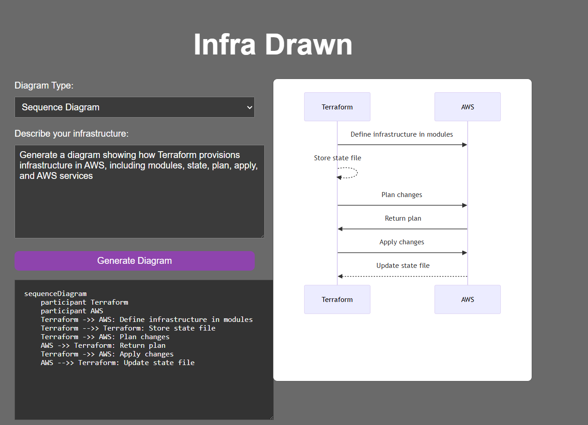

# Infra Drawn
### **Prompt + Architecure Diagram**
A work in progress application that turns natural language usage infrastucture description into clean, shareable diagrams. 

*Project Status*: WIP (actively evolving features). Core pipeline is in place. UI/UX diagram 'polish' are still being built. 

## What is this?
Infra Drawn helps you quickly visualize infrastructure ideas without opening a diagramming tool. You describe what you want (e.g., *API Gateway > Lambda > DynamoDB with S3 for uploading) and Infra Drawn generates a diagram you can iterate on. 

## Current Capabilities:
- Generate diagrams from a prompt via an API.
- Render diagram output in web app (Mermaid-based rendering).
- Repo includes infrastructure-as-code + CI scaffolding.

### Example Functionality:

## Roadmap:
- Polished UI (layout, empty states, loading, error handling)
- Better prompt-to-diagram reliability (guardrails + validation)
- Icon support / visual layout assistance (React Flow helper)
- Diagram export (PNG/SVG), share links
- Observability + rate limiting for API
- Saved diagrams + history
- Reverse functionality: Upload a previously generated Infra Drawn diagram (Mermaid) and generate a plain-language breakdown
    - Component glossary (what each box is)
    - Data/request flow narrative (*"What happens when a user clicks X?"*)
    - Assumptions + unknowns (clearly flagged)
    - Audience presets (Beginner/Technical/Executive Summary)

## Tech stack
- **Frontend:** React (web app) - lives in `apps/web`
- **Backend:** Node/Express API service - lives in `services/api`
- **Infra/CI:** Terraform + AWS scaffolding, CircleCI config 

Repo languages include: TypeScript/JavaScript + HCL (Terraform)

## How it works (high-level)
    1. User enters natural-language
    2. Frontend calls the API with the prompt + diagram type
    3. API returns Mermaid diagram syntax
    4. Frontend renders that output as a diagram, ready for iteration
    5. Planned (Reverse Mode): Infra Drawn will also support the reverse workflow, so a user can upload a diagram previously generated by Infra Drawn and receive an easy-to-understand plain-language explanation, useful for onboarding, documentation, and communicating architecture to stakeholders who aren't infrastructure-native.  